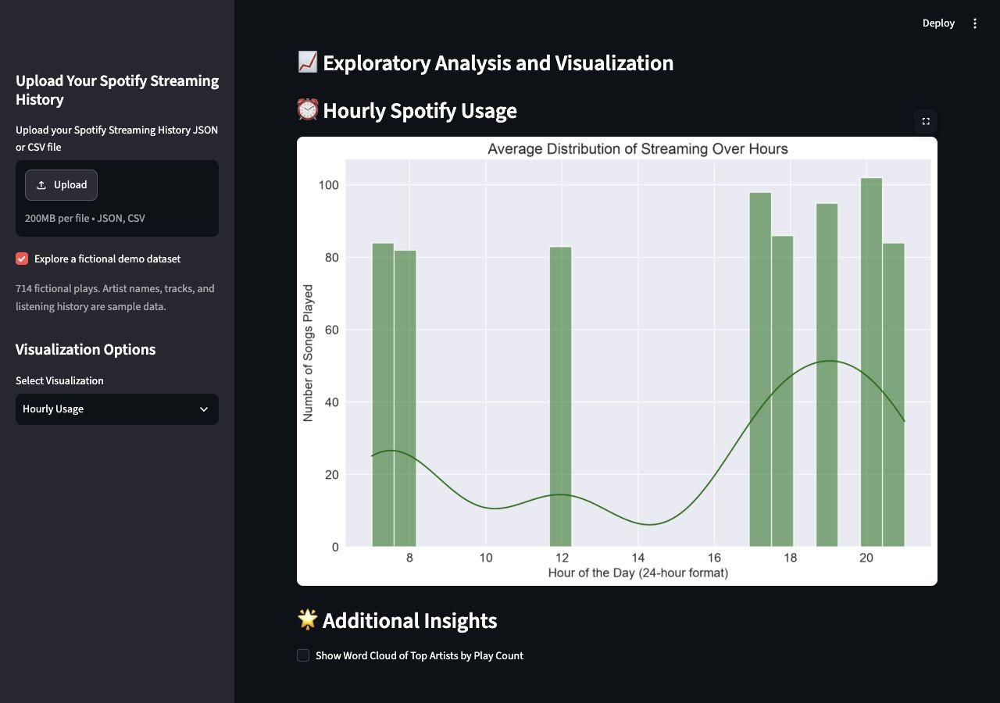

# Spotify Insights

Explore a listening-history export through artist rankings, track counts, and patterns across days and hours. Built by [VijaySreekar](https://github.com/VijaySreekar) and [GanapathiThota](https://github.com/GanapathiThota).

[Open the app](https://appspotifyinsights-zdr4w9e8yfszel8mxq275p.streamlit.app/) · [Run locally](#run-locally) · [Sample data](sample_data/README.md)



*Application capture using the included fictional dataset. Artists, tracks, and listening history are sample data.*

## Try it

Open the app and select **Explore a fictional demo dataset** in the sidebar. This loads 714 fictional plays without requiring an upload. Turn the option off to analyze your own JSON or CSV file.

The hosted app may sleep after inactivity. Use its wake-up button if prompted, or run the project locally.

## What you can explore

- **Artist analysis:** unique artists, play counts, listening time, and word clouds.
- **Track analysis:** frequently played tracks and unique-track counts.
- **Day-wise usage:** listening patterns across days of the week.
- **Hourly usage:** activity across hours of the day.
- **Listening time:** totals and daily patterns derived from play durations.

The sidebar switches between analyses. The page also displays the cleaned data and a statistical overview so the input behind the charts can be inspected.

## How it works

`app.py` contains the Streamlit interface and analysis pipeline:

1. Read a JSON or CSV export using pandas. CSV uploads support comma, tab, semicolon, or a custom delimiter.
2. Normalize a supported timestamp column and derive year, month, day, weekday, and hour.
3. Convert play duration from milliseconds into listening-time fields.
4. Group the data by artist, track, day, or hour and render tables and charts with Matplotlib, Seaborn, and WordCloud.

Data loading uses Streamlit's cache. This application analyzes uploaded exports; it does not connect to a Spotify account or request Spotify API credentials.

## Run locally

Use Python 3.12, which was used for the current smoke check.

```bash
git clone https://github.com/VijaySreekar/StreamLitSpotifyInsights.git
cd StreamLitSpotifyInsights
python3 -m venv .venv
```

Activate the environment:

```bash
# macOS / Linux
source .venv/bin/activate

# Windows PowerShell
.venv\Scripts\Activate.ps1
```

Install dependencies and start the app:

```bash
python -m pip install -r requirements.txt
python -m streamlit run app.py
```

Open the local URL printed in the terminal, then select the fictional demo dataset.

## Input format

For all analyses, include an artist, track, timestamp, and duration. This example is fictional:

```json
[
  {
    "endTime": "2026-01-01 18:30",
    "artistName": "Harbour Lights",
    "trackName": "Blue Hour",
    "msPlayed": 210000
  }
]
```

| Field | Accepted names |
| --- | --- |
| Timestamp | `endTime`, `Play Time`, `timestamp`, or `dateTime` |
| Duration in milliseconds | `msPlayed`, `Duration_ms`, or `duration_ms` |
| Artist | `artistName` |
| Track | `trackName` |

A CSV file uses these names as its header row. Exports using other schemas need conversion first.

## Current limitations

This is an exploratory analysis project. It expects a non-empty dataset with valid timestamps and the fields required by the selected analysis. Missing artist, track, or duration fields can prevent some views from running. Duration calculations are intended for individual song plays; audit the conversion before using unusual long-duration records. Charts describe the uploaded data and are not a statement about Spotify's full catalogue.

For personal listening history, run locally if you do not want to upload it to the hosted application.

## Validation

The empty state, demo selection, all five analysis options, and return to the empty state were smoke-checked using Streamlit's app testing interface. These checks cover the included sample dataset; they do not establish support for every Spotify export format.

## Contributing

For a bug report, include the failing analysis and a small synthetic example that reproduces it. Avoid attaching personal listening history. For changes, describe the behavior and how you checked it, and preserve the project’s coauthor credit.
